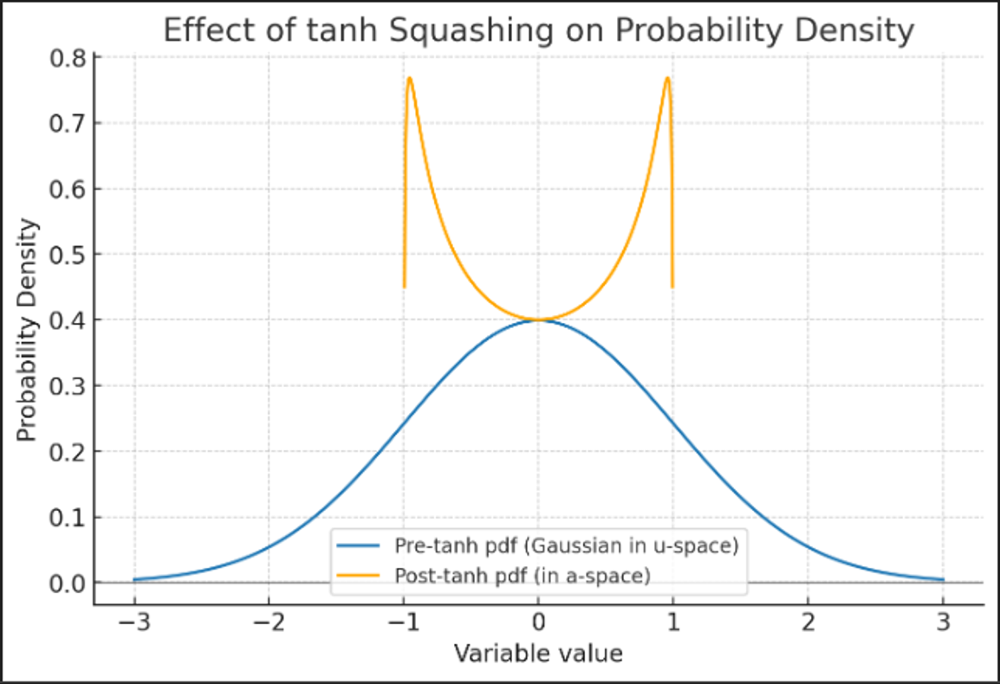

## Controlling Pendulum with SAC


## SAC (Soft Actor Critic), What is it?

Soft Actor-Critic (SAC) is an off-policy reinforcement learning algorithm for continuous action spaces.
The actor network outputs the mean and standard deviation of a Gaussian distribution, which defines the policy.
Two critic networks estimate Q-values to evaluate how good an action is in a given state.
SAC also incorporates entropy regularization into the loss function, balancing exploration and exploitation by encouraging stochastic policies.

## 📁 Project Structure

```text
sac-pendulum/
├── agents/
│   └── sac_agent.py         # SAC agent with actor-critic update logic and replay buffer
├── models/
│   ├── actor.py             # Actor network definition
│   └── critic.py            # Critic (Q-value) network definition
├── utils/
│   └── plot.py              # Training curve plotting utilities
├── config/
│   └── sac_config.yaml      # Hyperparameter configuration file
├── videos/                  # Recorded environment videos
│   └── rl-video-episode-0.mp4
├── results/
│   ├── rewards_plot.png     # Reward curve plot
│   └── saved_model.pth      # Final trained model checkpoint
├── main.py                  # Entry point for training/eval/render
├── train.py                 # Training loop
├── test.py                  # Evaluation script
├── requirements.txt         # Required packages
├── README.md                # Project overview and usage
└── .gitignore               # Common ignores (pycache, videos, etc.)


```

## ✅ Implemented Features

1. Preventing Q-value overestimation

```python
        # sac_agent.py, line 97
        q1_pi = self.critic_1(state, action_sample)
        q2_pi = self.critic_2(state, action_sample)
        min_q_pi = torch.min(q1_pi, q2_pi)
```

2. Soft target network update

```python
        # sac_agent.py, line 107
        for target_param, param in zip(self.critic_1_target.parameters(), self.critic_1.parameters()):
            target_param.data.copy_(self.tau * param.data + (1 - self.tau) * target_param.data)
        for target_param, param in zip(self.critic_2_target.parameters(), self.critic_2.parameters()):
            target_param.data.copy_(self.tau * param.data + (1 - self.tau) * target_param.data)
```

3. Annotated video with step and reward per frame

```python
        # main.py, line 72
        def add_text(get_frame, t):
                frame = get_frame(t)
                frame = cv2.cvtColor(frame, cv2.COLOR_RGB2BGR)
                step = int(video.fps * t)
                reward_val = rewards[step] if step < len(rewards) else 0
                text = f"Step: {step}  Reward: {reward_val:.2f}"
                cv2.putText(frame, text, (30, 50),
                        cv2.FONT_HERSHEY_SIMPLEX, 1, (0, 255, 0), 2)
                frame = cv2.cvtColor(frame, cv2.COLOR_BGR2RGB)
                return frame
```

4. Sampling from distribution during training (for exploration) and using log-probability in loss function

```python
        # sac_agent.py, line 37
        if eval_mode:
            action = mean
        else:
            dist = torch.distributions.Normal(mean, std)
            action = dist.rsample()
```

5. Computing log-probabilities from the probability density function, applying the Jacobian correction for the tanh transformation, and using a stable approximation to avoid overflow.

```python
        # sac_agent.py, line 60, 92
            log_prob = dist.log_prob(next_action).sum(dim=-1, keepdim=True)
            log_prob -= (2 * (np.log(2) - next_action - F.softplus(-2 * next_action))).sum(dim=-1, keepdim=True)
```

6. Unified entry point (`main.py`)

   * Provides a single interface for training, testing, and rendering through `--mode` argument.
   * Keeps the workflow consistent without requiring separate scripts.

## 🚀 How to Run

```bash
# Install dependencies
pip install -r requirements.txt

# Train the agent
python main.py --mode train

# Test the trained agent
python main.py --mode test

# Render and record video
python main.py --mode render
```

## ❓ Difficult Points

1. **Expectation of Entropy**

   * Entropy is defined as:
     \$H(\pi) = -\mathbb{E}\_{a \sim \pi}\[\log \pi(a|s)]\$
   * In practice, we approximate this expectation using a mini-batch.
     Since MSELoss averages over the batch, it serves as an approximation to the expectation.

2. **Why not use the PDF directly?**

<p align="center">
  
  <br><br>
  <sub>*Figure: Effect of applying tanh squashing. The Gaussian pdf in pre-activation space (u-space, blue, μ=0, σ=1) is transformed into the squashed pdf in action space (a-space, orange).*</sub>
</p>

* The Gaussian distribution is defined in the pre-activation space (u-space).
* However, actions are sampled in the transformed space (a = tanh(u)).
* To correct this mismatch, we apply the Jacobian of the transformation:

$$
\pi(a) = \pi_u(u) \cdot \left|\frac{du}{da}\right|, \quad
\log \pi(a) = \log \pi_u(u) + \log \left|\frac{du}{da}\right|
$$

The derivative gives:

$$
\log \left|\frac{du}{da}\right|
= 2(\log 2 - u - \mathrm{softplus}(-2u))
$$

* Implemented in code:

```python
log_prob = dist.log_prob(action_sample).sum(dim=-1, keepdim=True)
log_prob -= (2 * (np.log(2) - action_sample - F.softplus(-2 * action_sample))).sum(dim=-1, keepdim=True)
```
