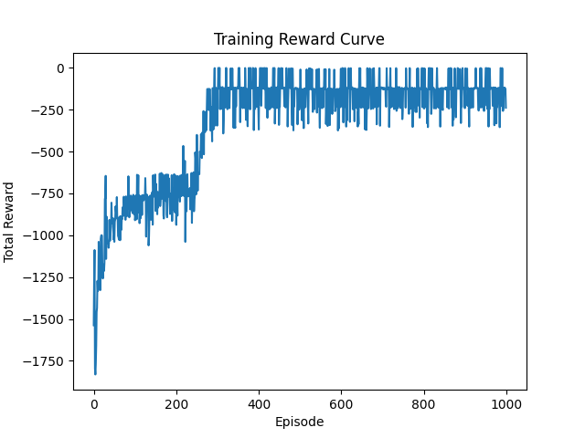

## Pendulum

  ## SAC (Soft Actor Critic), What is it?
Soft Actor-Critic (SAC) is off-policy RL algorithm for continuous action spaces.  
It uses an actor network to output mean and standard deviation of actions, creating a Gaussian policy.  
SAC also includes entropy regularization to balance exploration and exploitation, making the policy soft. 
![alt text]

https://www.youtube.com/watch?v=cy8r7WSuT1I&ab_channel=3Blue1Brown

## 📁 Project Structure

```text
sac-pendulum/
├── agents/
│   └── sac_agent.py         # SAC agent with actor-critic update logic and replay buffer
├── models/
│   ├── actor.py             # Actor network definition
│   ├── critic.py            # Critic (Q-value) network definition
│   └── value.py             # (Optional) Value network if using soft value update separately
├── utils/
│   └── plot.py              # Training curve plotting utilities
├── config/
│   └── sac_config.yaml      # Hyperparameter configuration file
├── videos/                  # Recorded environment videos
│   └── rl-video-episode-0.mp4
├── results/
│   ├── rewards_plot.png     # Reward curve plot
│   └── saved_model.pth      # Final trained model checkpoint
├── main.py                  # Entry point for training/eval/render
├── train.py                 # Training loop
├── test.py                  # Evaluation script
├── requirements.txt         # Required packages
├── README.md                # Project overview and usage
└── .gitignore               # Comon ignores (pycache, videos, etc.)


```





log_std


load model and even parameters of each Adam optimizer from pth

log_prob 이거 엔트로피 구하는거 같은데. 왜 tanh actionbound 하기 전에 하는거지? 아니 애초에 action 값나온게 action bound 안에 안드네?
그럼 안드는 데이터, 처음에 모델에서 나온 데이터로만 엔트로피 구해야 정확히 구해지는건가


F.softplus(-2 * u)  # log(1 + exp(-2u))


## implement
1. block overestimating q-value
```python
        # sac_agent.py, line 97
        q1_pi = self.critic_1(state, action_sample)
        q2_pi = self.critic_2(state, action_sample)
        min_q_pi = torch.min(q1_pi, q2_pi)
```
2. Soft update
```python
        # sac_agent.py, line 107
        for target_param, param in zip(self.critic_1_target.parameters(), self.critic_1.parameters()):
            target_param.data.copy_(self.tau * param.data + (1 - self.tau) * target_param.data)
        for target_param, param in zip(self.critic_2_target.parameters(), self.critic_2.parameters()):
            target_param.data.copy_(self.tau * param.data + (1 - self.tau) * target_param.data)
```
3. video with step and reward per frames
4. main.py  train test render


## Curious 헷갈렸던거

```python
        log_prob = dist.log_prob(action_sample).sum(dim=-1, keepdim=True)
        log_prob -= (2 * (np.log(2) - action_sample - F.softplus(-2 * action_sample))).sum(dim=-1, keepdim=True)
```
엔트로피: $H(\pi) = -\mathbb{E}_{a \sim \pi}[\log \pi(a|s)]$

$$
-\log(1 - \tanh^2(x)) = 2(\log(2) - x - \mathrm{softplus}(-2x))
$$
