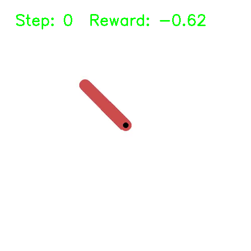

프레임별 reward/step/epsilon 표시, make gif and put it at readme

## Pendulum

## SAC (Soft Actor Critic), What is it?
Soft Actor-Critic (SAC) is a model-free, off-policy RL algorithm for continuous action spaces.  
It uses an actor network to output mean and standard deviation of actions, creating a Gaussian policy.  
SAC also includes entropy regularization to balance exploration and exploitation, making the policy soft. 
![alt text]


## 📁 Project Structure

```text
sac-pendulum/
├── agents/
│   └── sac_agent.py         # SAC agent with actor-critic update logic and replay buffer
├── models/
│   ├── actor.py             # Actor network definition
│   ├── critic.py            # Critic (Q-value) network definition
│   └── value.py             # (Optional) Value network if using soft value update separately
├── utils/
│   └── plot.py              # Training curve plotting utilities
├── config/
│   └── sac_config.yaml      # Hyperparameter configuration file
├── videos/                  # Recorded environment videos
│   └── rl-video-episode-0.mp4
├── results/
│   ├── rewards_plot.png     # Reward curve plot
│   └── saved_model.pth      # Final trained model checkpoint
├── main.py                  # Entry point for training/eval/render
├── train.py                 # Training loop
├── test.py                  # Evaluation script
├── requirements.txt         # Required packages
├── README.md                # Project overview and usage
└── .gitignore               # Common ignores (pycache, videos, etc.)


```


! [reward_plot](results/rewards_plot.png)